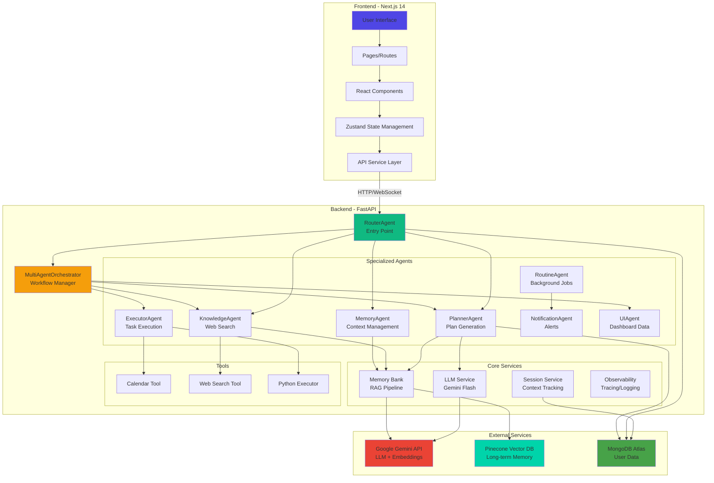

# LifePilot: AI-Powered Personal Growth Architect 🚀

  

**LifePilot** is an intelligent, agentic productivity system designed to act as your personal life architect. Unlike passive to-do lists, LifePilot uses a **Multi-Agent System (MAS)** powered by **Google Gemini** to actively plan, schedule, and manage your life.

---

## ✨ Key Features

This project demonstrates **3 Key Agent Concepts**:
1.  **Multi-Agent Orchestration**: A central `RouterAgent` and `MultiAgentOrchestrator` that delegate tasks to specialized workers (`Planner`, `Executor`, `Knowledge`).
2.  **RAG-Powered Long-Term Memory**: A `MemoryAgent` that uses **Pinecone Vector DB** to retain user context across sessions, solving "Context Amnesia".
3.  **Proactive Routine Management**: A `RoutineAgent` that runs in the background (Cron-like) to manage recurring tasks and health checks without user initiation.

---

## 📖 Table of Contents
- [Problem Statement](#-problem-statement)
- [Solution & Value](#-solution--value)
- [Architecture](#-architecture)
- [Technical Implementation](#-technical-implementation)
- [Setup & Installation](#-setup--installation)
- [Project Journey](#-project-journey)

---

## 🚩 Problem Statement
**The "Execution Gap" in Personal Productivity.**
We live in an era of decision fatigue. Most tools are passive containers—they store *what* you type but offer no intelligence on *how* to achieve it.
-   **Fragmentation**: Context is lost between calendars, notes, and to-do apps.
-   **Planning Fallacy**: Humans struggle to break down complex goals (e.g., "Learn DSA") into actionable steps.
-   **Context Amnesia**: Chatbots usually forget who you are after the session ends.

## 💡 Solution & Value
LifePilot bridges the gap between *knowing* and *doing*.
-   **Active Planning**: You say "I want to get fit," and the **Planner Agent** generates a 4-week workout schedule tailored to your free time.
-   **Unified Context**: The **Memory Agent** remembers your bad knees and prefers evening workouts, applying this constraint to every future plan.
-   **Automated Execution**: The **Executor Agent** and **Routine Agent** turn plans into database entries and reminders automatically.

---

## 🏗 Architecture

LifePilot employs a Hub-and-Spoke Agentic Architecture.

### Full-Stack Application Architecture



### AI Architecture


### Mind Map


### Architecture Diagram


### Core Components
1.  **RouterAgent (The Gatekeeper)**: Analyzes intent (regex/LLM) and routes requests.
2.  **PlannerAgent (The Architect)**: Uses Gemini to decompose goals into structured plans.
3.  **MemoryBank (The Hippocampus)**: Dual-layer memory (Session + Pinecone Vector Store).
4.  **ExecutorAgent (The Doer)**: Executes code and manages calendar events.

---

## 🛠 Technical Implementation

### Tech Stack
-   **AI**: Google Gemini Flash Lite, text-embedding-004
-   **Backend**: FastAPI (Python), LangChain
-   **Frontend**: Next.js 14, TailwindCSS, Framer Motion
-   **Database**: MongoDB Atlas (User Data), Pinecone (Vector Memory)
-   **Observability**: OpenTelemetry, Structlog

### Key Features
-   **Agent-to-Agent (A2A) Protocol**: Standardized messaging format for inter-agent communication.
-   **Context Compactor**: Smart pruning of conversation history to manage token windows efficiently.
-   **Resilient Error Handling**: Agents have fallback mechanisms (e.g., Planner falls back to rule-based steps if LLM fails).

---

## 🚀 Setup & Installation

### Prerequisites
-   Node.js 18+
-   Python 3.10+
-   MongoDB Atlas URI
-   Pinecone API Key
-   Google Gemini API Key

### 1. Backend Setup
```bash
cd backend
python -m venv venv
source venv/bin/activate  # or venv\Scripts\activate on Windows
pip install -r requirements.txt

# Create .env file
cp .env.example .env
# Fill in your API keys in .env

# Run the server
uvicorn app.main:app --reload
```

### 2. Frontend Setup
```bash
cd frontend
npm install

# Create .env.local file
cp .env.local.example .env.local
# Add NEXT_PUBLIC_API_URL=http://localhost:8000

# Run the development server
npm run dev
```

Visit `http://localhost:3000` to start using LifePilot!

---

## 🛣 Project Journey
Building LifePilot was a journey of moving from "Chatbot" to "Agent".
-   **Challenge**: Getting the AI to "remember" context meaningfully.
-   **Solution**: We implemented a RAG pipeline with Pinecone, allowing the agents to query past interactions before generating a plan.
-   **Challenge**: Managing complex, multi-step tasks.
-   **Solution**: We built the `MultiAgentOrchestrator` to handle state and workflow transitions, ensuring long-running tasks don't time out or get lost.


