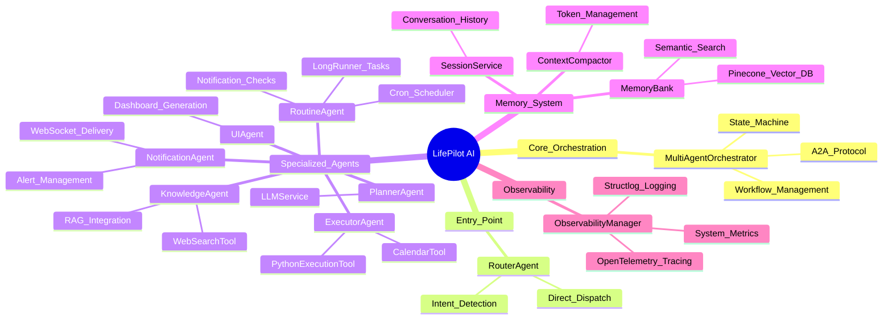

# LifePilot AI Architecture

```mermaid
mindmap
  root((LifePilot AI))
    Core_Orchestration
      MultiAgentOrchestrator
        Workflow_Management
        State_Machine
        A2A_Protocol
    Entry_Point
      RouterAgent
        Intent_Detection
        Direct_Dispatch
    Specialized_Agents
      PlannerAgent
        LLMService
      ExecutorAgent
        CalendarTool
        PythonExecutionTool
      KnowledgeAgent
        WebSearchTool
        RAG_Integration
      NotificationAgent
        Alert_Management
        WebSocket_Delivery
      RoutineAgent
        Cron_Scheduler
        LongRunner_Tasks
        Notification_Checks
      UIAgent
        Dashboard_Generation
    Memory_System
      MemoryBank
        Pinecone_Vector_DB
        Semantic_Search
      SessionService
        Conversation_History
      ContextCompactor
        Token_Management
    Observability
      ObservabilityManager
        OpenTelemetry_Tracing
        Structlog_Logging
        System_Metrics
```
